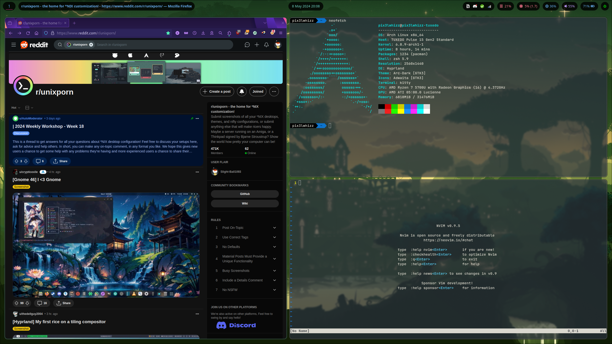
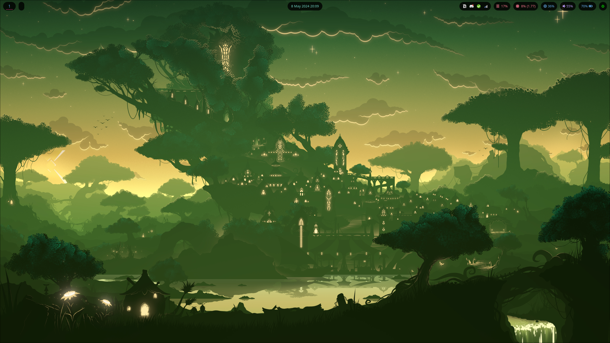

# dotfiles

- **OS**: Arch Linux
- **WM**: Hyprland
- **File Manager**: thunar
- **Browser**: firefox
- **Terminal**: kitty
- **Shell**: oh-my-zsh
- **Editor**: nvim
- **Status Bar**: waybar
- **Launcher**: wofi
- **PDF Viewer**: zathura
- **Theme**: Arc-Dark [GTK3]
- **Font**: JetBrains Mono Font

# Wallpaper:

